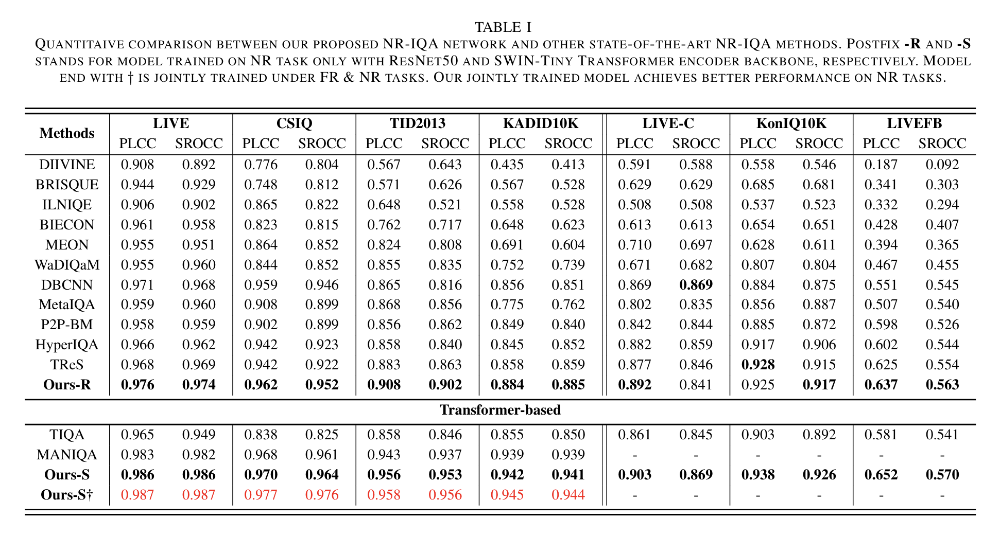
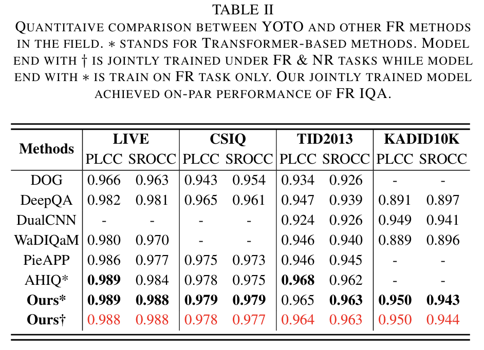

# YOTO: You Only Train Once for Full Reference and No Reference IQA
### [[Arxiv]](https://arxiv.org/abs/2310.09560)


### Updates
🚀 2025.12.20 Repo was refactored and published based on the lab code...

🚀 2025.12.15 Finally the author got some time ☕️...

### Environment

Please create your own conda env and install packages:
```bash
conda create --name iqa
pip3 install -r requirements.txt
````
### Data

As mentioned in the paper, we support following datasets: `CSIQ`, `KADID-10K`, `KONIQ-10K`, `LIVE`, `LIVE-C`, `LIVE-FB`, `TID2013`. 

You can download them via this link: [YOTO](https://drive.google.com/drive/folders/1PSjrSdwGMoY4hjtGAFejRms54fInrxmr?usp=drive_link). If there is any issue, you can always download the dataset from the official website and make sure the data structure is the same as ours.

Please unzip `data_txt.rar` under `your/path/YOTO/data/` and other dataset rar files into `your/path/YOTO/data/dataset`. Your data directory will look like below:
```
- data
  |- csiq.py
  |- csiq_label.txt
  |- (other files from data_txt.rar)
  |- dataset
    |- CSIQ
      |- dst_imgs
        |- xxx.png
      |- src_imgs
        |- xxx.png
      |- CSIQ.txt
    |- (other folders from xxx.rar)
```

### Pretrain Backbones
Our network uses pretrained Swin encoders, please download and put them under `models/pretrain/` directory.

[Swin-T-224x224](https://drive.google.com/file/d/15rynwfeezQXAoP3dbWuWFu-aQiVhOkN9/view?usp=drive_link)

[Swin-S-224x224](https://drive.google.com/file/d/19VrhmANWRDI15B-edUcRrePj5FwYjjFJ/view?usp=drive_link)

[Swin-B-224x224](https://drive.google.com/file/d/1djoMMTWzMhh1FxkqSPxorFnvUxhE0d7X/view?usp=drive_link)

### Training
We provide a sample training script for your easy start:
```bash
# FR/NR task

python train_FRNR.py \
--root_dir "your/root/dir" \
--network "model" \
--GPU 0 \
--model_name "FRNR_test" \
--dataset "csiq" \
--learning_rate 1e-4 \
--save_sh "./train_FRNR.sh" \
--n_epoch 600 \
--T_max 50 \
--batch_size 16 \
--num_avg_val 20 \
--output_path "./output" \
--training_mode "FR"
```
Remember always indicate your root dir via `--root_dir` since it is linked to dataset.

the `--network` flag is used to indicate your model file name under `models` folder, and your network class needs to be named as `Net` (⚠️very important!⚠️).

the `--model_name` flag is used to indicate checkpoint name when you save. i.e., your checkpoint will be located at `{output_path}/{dataset}/{model_name}/xxx.pth`

the `--training_mode` flag is used to indicate your `FR` or `NR` IQA training.

To modify more options on your own, please refer to file `options.py`

To monitor training progress, use tensorboard:

```
tensorboard --logdir /path/to/logs --port your_port
```

### Inferencing
For inference, adjust the `--infer_mode` flag for `FR/NR` models and other flags on your demand:
```bash
python inference_FRNR.py \
--root_dir "your/root/dir" \
--network "model" \
--dataset "csiq" \
--GPU 0 \
--batch_size 16 \
--num_avg_val 5 \
--checkpoint "your/checkpoint/path" \
--infer_mode "NR"
```

### Performance
#### NR IQA:


#### FR IQA


### Unit Tests
We use `bahave` and `sure` for unit tests to ensure the integrity.

To run all unit tests: `behave /your/path/YOTO/features`

To run a specific unit test: `behave /your/path/YOTO/features/test_name.feature`

You should see all tests passed
### Contributions
For any contributions, please feel free to submit a pull request. Remember to format your code with `black` via command `python3 -m black ./`

### Cite & Others
Currently, only Arxiv citation is available
```
@misc{yun2024trainonceunifiedframework,
      title={You Only Train Once: A Unified Framework for Both Full-Reference and No-Reference Image Quality Assessment}, 
      author={Yi Ke Yun and Weisi Lin},
      year={2024},
      eprint={2310.09560},
      archivePrefix={arXiv},
      primaryClass={cs.CV},
      url={https://arxiv.org/abs/2310.09560}, 
}
```
We will update the citation once our paper is accepted, currently under review.
